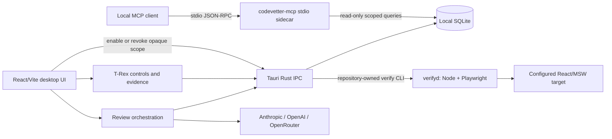

# Architecture

## System overview

CodeVetter is a local-first macOS desktop application for reviewing and verifying
agent-generated code. The active product is `apps/desktop`: a React 19/Vite
webview inside a Tauri 2 shell. Rust owns local Git and process operations, local
SQLite persistence, and the typed IPC boundary. The webview owns the product UI
and review orchestration. User-configured AI providers are contacted only for
AI-assisted review; deterministic warm browser verification makes no model calls.
An independently packaged Rust stdio sidecar exposes explicitly enabled local
graph and history scopes to MCP clients without opening a network listener.

The warm verifier deliberately supports one developer, one explicitly configured
React web app, one Mac, and one Chromium browser. It is not a CI service, cloud
browser platform, team runner, mobile runner, cross-browser service, or arbitrary
repository orchestrator.

## Component diagram



The Tauri bridge does not bundle Node or Chromium. It finds exactly one
repository-owned `verify` script, selects `pnpm`, `npm`, `yarn`, or `bun` from
the repository lockfile, and invokes it with direct arguments. The target
repository therefore owns its JavaScript runtime, Playwright installation,
scenario code, and app command.

## Primary data flows

### Local review

1. Review selects a local repository and exact diff through typed Tauri IPC.
2. The review pipeline combines the diff with local history, graph, intent,
   verification, and rubric evidence.
3. The configured provider evaluates the bounded prompt.
4. Findings, evidence, dispositions, and verification artifacts are persisted
   in local SQLite and rendered in Review.
5. Fix and re-review workflows keep their worktrees and evidence linked to the
   original review.

### Warm changed-capability verification

1. `verify changed` collects an exact worktree, staged, commit, or range
   identity and validates `.codevetter/verify.yaml`.
2. Explicit path mappings select capability scenarios. Mandatory smoke and
   shared-infrastructure fallback rules preserve safe coverage. Graph, import,
   and runtime hints may add or rank work but cannot remove explicit coverage or
   create passing evidence.
3. `verifyd` reuses one owned target server and one Playwright Chromium process.
   Each scenario still receives a fresh isolated browser context with copied
   authentication state, named target-owned MSW state, frozen time and flags,
   strict request policy, and direct route entry.
4. Deterministic scenarios and automatic observers collect runtime, console,
   network, mutation, route, accessibility, visual, and interaction evidence
   with zero model calls.
5. Results are `passed`, `regression`, or `no_confidence`. Stale, cancelled,
   incomplete, operational, or identity-mismatched results cannot pass.
6. The Tauri bridge persists complete versioned results immutably in
   `warm_verification_runs`. The older `synthetic_qa_runs` records remain
   readable and unchanged.

### T-Rex control plane

T-Rex is the operational surface for the selected repository. It starts and
stops the daemon, launches a changed-capability run with a UI-owned run ID,
polls health only while that owned run is pending, cancels only the exact owned
run, lists recent immutable results, and requests bounded artifact cleanup.
Commands cross typed IPC into the Rust bridge, which validates repository
containment, manifest shape, output size, timeouts, and the verifier's JSON
contract before accepting or persisting anything.

### Review exact-current qualification

Review does not start, stop, cancel, or clean the verifier. Its audience
validation panel is read-only: it loads only the newest stored warm run for the
repository and independently collects the current worktree/config/manifest/
source identity. Executable evidence qualifies only when every identity matches
and the run completed with the required passing observations. A legacy QA pass,
older pass, stale run, cancellation, regression, missing identity, or
`no_confidence` result cannot satisfy the executable stage.

### Local history MCP

1. Settings prepares a disabled opaque repository scope and shows the exact
   credential-free client command. Nothing is exposed until the user enables
   that indexed scope.
2. The packaged `codevetter-mcp` sidecar serves versioned JSON-RPC over stdio.
   It opens no TCP listener and rechecks scope enablement on every request, so
   revocation affects an already-running client.
3. Thirteen read-only tools and versioned resources share the same structural
   graph, release, history, lineage, causal-trace, comparison, annotation, and
   evidence read services used by the desktop product.
4. Opaque IDs, protected-path and secret-shape filtering, response and traversal
   bounds, strict schemas, paginated evidence hydration, redacted errors, and
   metadata-only audit rows apply before a response leaves the process.
5. Disabling the scope rejects later requests without disclosing repository
   availability. Setup and reads never modify the protected repository.

## Persistence and retention

SQLite is embedded through `rusqlite`; there is no application server. The
`warm_verification_runs` table is additive and immutable. It stores the complete
versioned result contract, while adapters project bounded evidence into existing
Review and synthetic-QA models without rewriting legacy rows.

Passing runs retain a summary by default. Failure or explicitly detailed runs
may retain redacted artifacts under configured count, byte, and age limits.
Cleanup follows no symlinks and deletes only owner-marked run data. The shared
Playwright browser cache is reported for storage visibility but is never deleted
automatically.

## Key implementation boundaries

| Boundary | Location | Responsibility |
|---|---|---|
| React application | `apps/desktop/src/` | Product UI, review flow, T-Rex, read-only evidence qualification |
| Typed IPC client | `apps/desktop/src/lib/tauri-ipc.ts` | Browser-safe wrappers for Tauri commands |
| Tauri backend | `apps/desktop/src-tauri/src/` | Local Git/process/filesystem operations and SQLite |
| Warm verifier core | `apps/desktop/src/lib/warm-verification/` | Config, selection, daemon, scenario runtime, observers, evidence, retention |
| Differential verifier | `apps/desktop/src/lib/warm-verification/differential-*` | Exact target preparation, paired runtime, normalization, comparison, and cleanup |
| Repository bridge | `apps/desktop/src-tauri/src/commands/warm_verification_bridge.rs` | Safe discovery and invocation of the repository-owned verifier |
| Warm persistence | `apps/desktop/src-tauri/src/commands/warm_verification.rs` | Strict validation and immutable SQLite insert/list operations |
| Differential persistence | `apps/desktop/src-tauri/src/commands/differential_verification.rs` | Additive pair summaries that cannot create pass evidence |
| T-Rex surface | `apps/desktop/src/pages/TRex.tsx` | Owned run control and evidence display |
| Review qualification | `apps/desktop/src/lib/audience-validation.ts` | Exact-current executable-evidence policy |
| MCP sidecar | `apps/desktop/src-tauri/src/bin/codevetter-mcp.rs` | Private stdio server bootstrap and bounded protocol lifecycle |
| MCP protocol | `apps/desktop/src-tauri/src/mcp/` | Strict tools/resources, scoped access, redaction, pagination, and audit |
| MCP setup | `apps/desktop/src-tauri/src/commands/mcp_access.rs` | Repository enablement, revocation, client config, and audit controls |

## Repository layout

```text
apps/
  desktop/             active Tauri + React product
  landing-page-astro/  marketing site
docs/                  product and operator documentation
openspec/              accepted specs and in-progress changes
scripts/               repository maintenance and benchmark helpers
```

The root pnpm workspace contains `apps/*` only; earlier shared-library and edge
service workspaces are no longer part of the product repository.

## Qualification state

The mandatory 20-scenario named-machine gate measured **3605.560 ms p50,
4792.196 ms p95, and 5320.379 ms max**. The normal small changed-capability path
measured **506.426 ms p50, 512.035 ms p95, and 515.900 ms max**. A separate
100-batch stability run completed 80 passes, 10 intentional regressions, and 10
cancellations with no leaked contexts, stable browser/server identities, RSS
growth of 13.6 MB against a 128 MB cap, retention at 20 runs / 4470 bytes, and
zero production builds. Local release qualification passed on 2026-07-15; the
release workflow remains a separate explicit action and has not run.

The packaged MCP qualification used 65 commits, 64 releases, 10,000 history
events, 512 nodes, and 1,024 edges. Process initialization measured 7.17 ms p95;
graph queries 5.82 ms p95; broad history search 6.45 ms p95; and four-request
mixed concurrency 12.87 ms p95. The 7.39 MiB sidecar opened no network listener,
stayed within its 32 MiB RSS gate, and left the protected repository unchanged.
