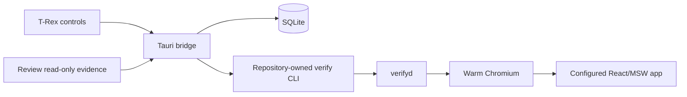

# Synthetic user QA

Synthetic user QA is CodeVetter's runtime proof layer for agent-written code.
Static review asks whether a diff looks risky; runtime verification asks whether
an affected user capability still works and preserves the evidence needed to
trust that answer.

There are two compatible paths:

- legacy synthetic-QA runners for built-in, repository Playwright, external, and
  fixture workflows;
- the warm deterministic verifier for fast changed-capability checks.

Both can project evidence into Review, but warm results have a stronger exact-
current identity contract. Legacy rows remain readable and are never rewritten
or silently promoted into current warm evidence.

## Warm deterministic path

The warm verifier supports one developer, one explicitly configured React web
app, one Mac, and one Chromium. `verifyd` keeps the declared target server and
browser process alive while creating a fresh isolated context for every
scenario. Checked-in mappings select deterministic scenarios from the exact Git
change set. Target-owned MSW state, copied authentication state, frozen time and
flags, request policy, direct route entry, automatic observation, and teardown
run with zero model calls.

Results preserve the exact change-set, config, manifest, verifier-source, and
target identities. Outcomes are:

- `passed`: every required selected scenario completed with qualifying evidence;
- `regression`: deterministic application behavior or an invariant failed;
- `no_confidence`: selection, setup, execution, identity, cancellation, or
  operational state was insufficient to make a product claim.

Stale, cancelled, incomplete, and operational results never become passes.

## Product surfaces

### T-Rex owns execution

T-Rex is the operational warm-verification console. For the selected repository
it can:

- inspect daemon health;
- start and stop the repository daemon;
- run the changed-capability selection with a UI-owned run ID;
- cancel only that exact owned run;
- show recent immutable evidence;
- request bounded artifact cleanup.

The Tauri bridge finds exactly one repository-owned `verify` script, selects its
package manager from the repository lockfile, invokes it without a shell, limits
time and output, validates its JSON contract, and persists accepted results. It
does not bundle Node, a package manager, Playwright, or Chromium.

### Review consumes evidence

Review is deliberately read-only. Audience validation requests only the newest
stored warm run for the repository and independently collects the current
identity. Executable evidence qualifies only when every identity matches and the
newest run passed. A previous pass, legacy synthetic-QA pass, stale run,
regression, cancellation, missing identity, or `no_confidence` result cannot
satisfy the executable stage.

This keeps "the test passed earlier" separate from "the exact code under review
passed now."

## Automatic observations

Every warm scenario captures the declared assertions plus automatic invariants:

- uncaught exceptions and console errors;
- failed and unexpected requests;
- duplicate or unexpected mutations;
- route changes;
- accessibility violations;
- exact visual-baseline differences;
- slow interactions;
- scenario and batch timing;
- source invalidation and cancellation state.

Unexpected third-party traffic is blocked by default. Authentication state,
cookies, bearer tokens, and environment values must never enter persisted
evidence.

## Persistence and retention

`warm_verification_runs` is an additive immutable SQLite table. Each accepted
record contains the complete versioned result. Bounded adapters may project the
same run into existing synthetic-QA and Review evidence shapes without changing
its source meaning.

Passing runs keep only `run-summary.json` unless detailed capture was requested.
Regression and `no_confidence` runs may keep redacted artifacts. Retention
applies configured run-count, byte, and age caps, removes only owner-marked data,
and never follows symlinks. The shared Playwright browser cache is reported but
never deleted automatically.

Legacy synthetic-QA records and storage keys remain compatible:

- reusable QA presets and workflows;
- review-scoped QA history;
- Playwright JSON reports, logs, screenshots, traces, and videos;
- `SyntheticQaRunResult.screenshot_path` plus the multi-artifact `artifacts[]`
  contract.

## Measured qualification

The 2026-07-15 named-machine qualification used a checked-in React/Vite/MSW
target and real Playwright Chromium.

The mandatory 20-scenario gate measured **3605.560 ms p50, 4792.196 ms p95,
and 5320.379 ms max** over whole invocations after warm-up. The separate small
changed-capability path measured **506.426 ms p50, 512.035 ms p95, and 515.900
ms max**.

A further 100 warm batches completed 80 passes, 10 intentional regressions, and
10 cancellations with no leaked contexts, stable target/browser reuse, RSS
growth of 13.6 MB against a 128 MB cap, retention at 20 runs / 4470 bytes, and
zero production builds.

These figures apply only to one developer, one configured React app, one Mac,
and one Chromium. They are not CI, cloud, team, mobile, Safari, Firefox, or
arbitrary-repository claims. Local release qualification passed on 2026-07-15;
the explicit release workflow has not run and no release is claimed here.

## Architecture

## Related implementation

- `apps/desktop/src/lib/warm-verification/` — verifier contracts, selection,
  daemon, observers, adapters, and retention
- `apps/desktop/src-tauri/src/commands/warm_verification_bridge.rs` — safe
  repository CLI bridge
- `apps/desktop/src-tauri/src/commands/warm_verification.rs` — validation and
  immutable persistence
- `apps/desktop/src/pages/TRex.tsx` — operational controls and evidence
- `apps/desktop/src/lib/audience-validation.ts` — exact-current Review policy
- `apps/desktop/src/lib/synthetic-qa/` — legacy QA runners and evidence mapping
- `docs/WARM-VERIFICATION.md` — target configuration and operator guide
