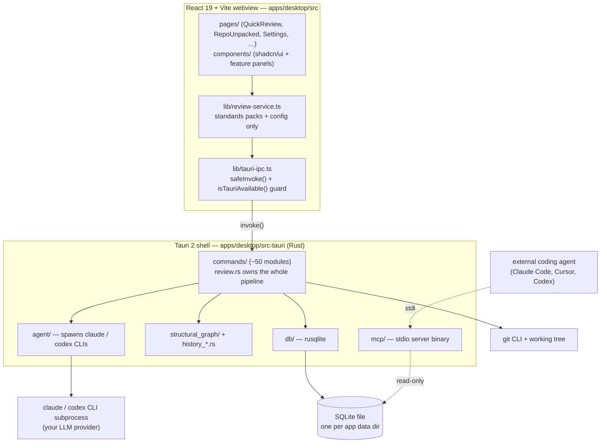

# How CodeVetter works: end-to-end

This is the **starting point** for understanding CodeVetter. It connects the
pieces at a high level and points to the detailed per-component docs for the
depths. If you read one architecture page first, read this one.

CodeVetter is a **local-first macOS desktop app** for evidence-backed review of
agent-generated code. There is no server and no CodeVetter-hosted review path:
the review engine, session indexer, structural graph, history workbench, and
optional MCP server all run on your machine against one local SQLite file.

## The four things to hold in your head

1. **A webview UI you click** (React), **a native shell** (Tauri 2 / Rust) that
   does everything privileged — git, files, subprocesses, SQLite — and a **local
   database** the two share. The webview never touches the disk or the network
   directly; it asks Rust to.
2. **A review loop**: review → fix → re-review → proof. A change goes in, a
   ranked set of findings comes out, you fix some, and re-review confirms which
   are actually gone.
3. **Two read-only context sources** — a syntax-aware **structural graph** and a
   **release-history workbench** — that orient a review but never invent
   findings on their own.
4. **An opt-in MCP sidecar** that exposes those same read-only sources to *other*
   coding agents.

## Components and how they connect

If Mermaid does not render above, read it as: the UI calls the service layer,
which calls the IPC bridge, which `invoke()`s a Rust command; Rust commands own
git, the CLI agent subprocess, the graph/history services, and the rusqlite
database; a separate read-only MCP binary reads the same SQLite file over stdio
for external agents.

### The webview (`apps/desktop/src`)

React 19 + Vite. This is the **only** user surface. Route screens live in
`pages/` (e.g. `QuickReview.tsx`, `RepoUnpacked.tsx`, `Settings.tsx`), panels and
shadcn/ui primitives in `components/`. State is local React state; anything
durable or privileged goes through IPC. Notably, `lib/review-service.ts` does
**not** run the review — it only manages standards-pack config and builds the
standards-context string that gets passed to the backend. See
[overview.md](./overview.md) for the full layer table.

### The IPC bridge (`lib/tauri-ipc.ts`)

Every Rust↔webview call goes through Tauri's `invoke()`, wrapped in
`safeInvoke()`. If `window.__TAURI_INTERNALS__` is absent (plain `vite dev`, SSR,
Storybook) it throws a distinguishable `TAURI_NOT_AVAILABLE` so the same React
code renders a fallback instead of crashing. The typed interfaces here mirror the
Rust structs in `db/queries.rs` one-for-one — change one side, change the other.
Details: [ipc-and-commands.md](./ipc-and-commands.md).

### The Rust backend (`apps/desktop/src-tauri/src`)

~50 command modules under `commands/`, each registered in `main.rs`. Rust does
all file I/O, git, subprocess spawning, the structural graph, history
reconstruction, and SQLite access. The review pipeline itself — diff, prompt,
tiers, specialists, coordinator, dedup, score, save — lives entirely in
`commands/review.rs`.

### SQLite via rusqlite (`db/`)

One local file at the Tauri app-data dir. Reviews land in `local_reviews` +
`local_review_findings`; the graph in `structural_graph_*` tables; sessions,
history, QA, audience, and provider tables round it out. Persistence boundaries
are in [data-model.md](./data-model.md).

## How a review actually flows

Grounded in `apps/desktop/src/pages/QuickReview.tsx` and
`apps/desktop/src-tauri/src/commands/review.rs`:

1. **You pick a repo + diff range** in QuickReview and click review. The page
   calls `runCliReview(...)` (`tauri-ipc.ts`), which `invoke`s the Rust
   `run_cli_review` command.
2. **Rust runs the diff.** `run_cli_review_core` shells out to `git diff`,
   truncates at 100 KB, and collects the changed-file list. (This core is
   deliberately state-free so the public benchmark harness can run the *exact*
   production pipeline headlessly.)
3. **Rust picks a risk tier** from the changed set (`is_sensitive_review_path` +
   changed-line count): **trivial** (≤10 lines, no sensitive paths — assumption
   + general specialists, no coordinator), **lite** (≤100 lines), or
   **full / full-sensitive** (security + product + agent specialists **plus** a
   coordinator pass). Sensitive paths (auth, secrets, migrations, …) force the
   full tier.
4. **Rust builds the prompt** per specialist, folding in the standards-context
   string the webview sent and a blast-radius summary, then **spawns the CLI
   agent** (`claude` / `codex`, via `agent/cli_brain.rs`) as a subprocess. The
   LLM call is the subprocess — your provider, your key, your machine. There is
   no HTTP call to a CodeVetter server.
5. **Rust parses + dedupes findings.** `dedupe_findings` runs two passes: exact
   `file:line:title` collapse, then near-duplicate clustering
   (`is_duplicate_finding`: same file AND close lines or high token-Jaccard
   similarity), keeping the higher-severity/confidence statement. On the full
   tier a coordinator prompt reconciles the specialists and enforces the
   assumption-integrity rule (drop findings resting on an unconfirmed premise).
6. **Rust saves** to `local_reviews` + `local_review_findings` and returns a
   scored, ranked `ReviewFinding[]`.
7. **The UI renders** the QuickReview editor-primary layout with a verdict
   sidebar.

**Fix loop**: you select findings, an `agent-fix-packet` is built (goal,
acceptance criteria, non-goals, evidence refs), fixes run in an **isolated git
worktree** (`create_fix_worktree` under `.codevetter-worktrees/`, never your
working tree), and re-review runs the same pipeline against the fix diff. Each
finding gets a `fixed` / `reproduced` / `unchecked` status. The full mechanics,
standards packs, and the reviewer-handoff proof live in
[review-pipeline.md](./review-pipeline.md).

## Context sources (not finding sources)

The **structural graph** (tree-sitter across 15 language variants, communities,
trust-weighted paths) and the **release-history workbench** (immutable
checkpoints, causal `what/why/when` queries) are persisted to SQLite and fed
into a review as **navigation context only**. They can prove a *local* fact — a
definition exists, a path connects two symbols, a release touched a file — but
they cannot create findings, severities, or verified-runtime claims, and code
emission never implies external ingestion without imported evidence. This
boundary is load-bearing; see [graph-and-history.md](./graph-and-history.md).

The same read-only graph + history is exposed to *other* local coding agents
through the opt-in, stdio-only **MCP sidecar** (13 bounded tools, no network, no
mutation). See [mcp-sidecar.md](./mcp-sidecar.md).

## Key design decisions and why

- **Local-first, no server.** Code and diffs never leave your machine except to
  the LLM provider you configure. The CSP in `tauri.conf.json` pins egress to
  exactly `api.codevetter.com` (update/telemetry) and `api.github.com` (PR
  reads); the LLM call is a local CLI subprocess, not webview traffic. Privacy
  and offline use are the point.
- **rusqlite, not `@tauri-apps/plugin-sql`.** The DB layer is Rust-internal so
  schema, migrations, and queries stay in one typed place. `plugin-sql` was
  removed in the 2026-07-11 desloppification sweep — do not re-add it.
- **Pipeline in Rust, config in TS.** Keeping diff/tiers/specialists/dedup in
  `review.rs` lets the benchmark harness run the identical pipeline headlessly
  and keeps privileged work on the privileged side; the webview only owns
  standards-pack config.
- **Multi-provider by CLI subprocess.** CodeVetter spawns whichever CLI you have
  (`claude`, `codex`; Gemini via local-ai) rather than embedding one SDK, so you
  bring your own provider and key. Provider presets
  (Anthropic / OpenAI / OpenRouter / free-ai gateway) live in
  `review-service.ts`.
- **`isTauriAvailable()` guard everywhere.** One code path runs in the real app
  and degrades cleanly in a browser dev build.

## Where to go next

- [overview.md](./overview.md) — layer table, invariants, what was removed.
- [ipc-and-commands.md](./ipc-and-commands.md) — the bridge + full command map.
- [review-pipeline.md](./review-pipeline.md) — the review loop in depth.
- [data-model.md](./data-model.md) — SQLite tables and boundaries.
- [graph-and-history.md](./graph-and-history.md) — the two context sources.
- [mcp-sidecar.md](./mcp-sidecar.md) — the opt-in MCP server.
- [../development/setup.md](../development/setup.md) — build and run it yourself.
