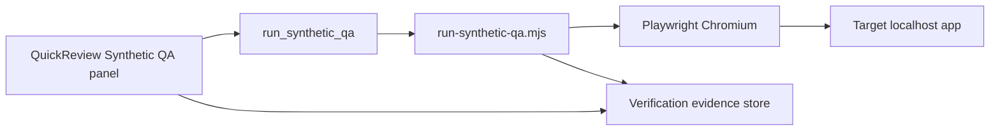

Product brief for the smallest CodeVetter workflow that exercises a changed web surface and stores evidence next to review findings.

## Product direction

Synthetic User QA should become CodeVetter's runtime proof layer for agent-written code. Static review asks "does this diff look suspicious?" Synthetic QA asks "can a user still complete the intended workflow, and what evidence proves it?"

The right boundary is orchestration plus evidence normalization, not owning every browser-testing technique. CodeVetter should be able to run:

- a built-in deterministic Playwright loop,
- a user-authored QA script from the reviewed repo,
- a Claude skill that logs in, navigates, clicks, fills forms, and validates outcomes,
- a Stagehand-backed natural-language browser flow when the target app is hard to script,
- a replay fixture for deterministic regression checks.

All runners should return the same `SyntheticQaRunResult` contract so QuickReview can attach evidence to findings, promote reproduced bugs, and export reviewer proof.

## What first-class Synthetic QA should include

### 1. Target and environment discovery

- Base URL and route, with detection from `package.json`, `vite.config.*`, `playwright.config.*`, Repo Unpacked, or recent dev-server history.
- App command hints such as `npm run dev`, `npm run preview`, or repo-local Playwright setup, shown as prerequisites rather than auto-run by default.
- Auth mode: none, saved local session, user-provided test credentials reference, existing browser storage state, or external skill-managed login.
- Safe scope controls: loopback URLs by default, explicit opt-in for remote targets.

### 2. Goal-oriented loop definitions

Each QA loop should have:

- user goal,
- route or entry URL,
- setup/preconditions,
- steps attempted,
- expected outcome,
- selectors or natural-language targets,
- data used,
- cleanup expectation,
- linked finding or changed surface.

The useful unit is not "visit route"; it is "complete a user task that the diff may have broken."

### 3. Runner types

CodeVetter should support these in order:

1. **Built-in Playwright loops** for deterministic smoke checks and visual proof.
2. **Repo-local Playwright tests** selected from touched routes/files.
3. **Claude skill runner** for login-heavy or exploratory user flows where the skill can use Playwright/Stagehand and adapt to UI changes.
4. **Stagehand runner** for natural-language flows where selectors are unstable or unknown.
5. **Fixture replay** for deterministic offline regression checks.

The Claude skill should be treated as a high-capability runner, not as the storage format. CodeVetter owns the run record, artifacts, and finding mapping.

### 4. Evidence captured

Minimum evidence:

- pass/fail,
- notes in human-readable form,
- step log with status per step,
- final URL and page title,
- screenshot on failure,
- console errors,
- duration,
- runner error vs app failure distinction.

Better evidence:

- screenshots at key steps,
- Playwright trace zip,
- video on failure,
- network errors and failed responses,
- DOM snapshot or accessibility snapshot,
- storage-state/auth summary without secrets,
- retry count and flaky-step marker,
- exact command/skill invocation used,
- changed files/routes suspected to be related.

Never store secrets, raw cookies, bearer tokens, or full credential material in the evidence record.

### 5. Finding integration

Synthetic QA should not become a separate dashboard first. It should feed the Review workflow:

- passing loop: mark selected finding `not_reproduced` or add proof to a fixed finding,
- failing loop: mark selected finding `browser` + `reproduced`, or create a QA finding,
- runner/setup failure: show operational error, do not create an app bug finding,
- fixed finding: require re-run or artifact before "fixed" counts as verified,
- handoff export: include goal, step summary, artifact paths, and remaining unchecked flows.

### 6. Suggested first implementation slice

Add a runner registry with a common input/output contract:

- `playwright_builtin`: current built-in loop,
- `repo_playwright`: runs a selected repo-local Playwright spec with the repo's local Playwright binary,
- `external_skill`: runs a user-configured command, including the Claude QA skill, and expects JSON on stdout,
- `fixture`: current deterministic replay path.

Then extend the UI from "Base URL + Loop" to "Target + Runner + Goal + Evidence." Keep the first UI small: one configured external command, one base URL, one goal field, and a run result mapped to the selected finding.

External runner invocation:

```bash
<command> --base-url <url> --loop-id <id> --route <path> --goal <goal> --artifact-dir <dir> --auth-mode <none|storage_state> [--storage-state <path>]
```

The command must print one JSON line matching `SyntheticQaRunResult`. If it cannot complete because the dev server is down, auth is missing, or the runner itself fails, it should set `error` and CodeVetter will treat the result as an operational failure rather than an app bug.

Implemented v1 storage:

- `quick_review_qa_preset`: one local reusable preset for base URL, target route, auth mode, storage-state path, loop, runner, repo Playwright spec, repo trace mode, goal, and external command.
- `quick_review_qa_workflows`: named local workflows for reusable base URL, route/goal target matrices, auth mode, storage-state path, remote-target opt-in, loop, runner, repo Playwright spec, repo trace mode, goal, and external command presets.
- `quick_review_qa_runs_<review_id>`: recent QA run history for a review, capped in the UI.
- Repo-local Playwright spec discovery is available from the Review QA panel.
- Repo-local Playwright runs use Playwright's JSON reporter, save the raw log plus parsed report under the run artifact directory, run with a selected trace mode (`retain-on-failure` by default), force Playwright output into the QA artifact directory, map failing test titles/error messages into `trace.console_errors`, and surface Playwright attachment paths such as screenshots, traces, and videos in notes/evidence. The saved JSON report and raw log are retained in `artifacts[]` even when the repo spec does not emit screenshots/videos.
- `SyntheticQaRunResult` now carries both `screenshot_path` for backward-compatible primary artifact display and `artifacts[]` for all captured screenshots, traces, videos, logs, or reports. The Review panel labels common artifact types, can open local artifacts through the desktop shell, and can preview text-like artifacts with a bounded 60-line read.

Repo Playwright runner detail: CodeVetter prefers `<repo>/node_modules/.bin/playwright test <spec> --reporter=json --trace <mode> --output <artifact-dir>/repo-playwright-output` and only falls back to `npx playwright` when no local binary exists. The spec path must be repository-relative.

Repo Playwright specs receive run context through environment variables:

| Env var | Meaning |
|---------|---------|
| `CODEVETTER_SYNTHETIC_QA_BASE_URL` | Selected base URL, without a trailing slash |
| `CODEVETTER_SYNTHETIC_QA_ROUTE` | Selected target route |
| `CODEVETTER_SYNTHETIC_QA_LOOP_ID` | Selected loop id |
| `CODEVETTER_SYNTHETIC_QA_GOAL` | User goal text |
| `CODEVETTER_SYNTHETIC_QA_AUTH_MODE` | `none` or `storage_state` |
| `CODEVETTER_SYNTHETIC_QA_STORAGE_STATE` | Storage-state path when auth mode uses one |
| `CODEVETTER_SYNTHETIC_QA_ARTIFACT_DIR` | Directory where the spec can write screenshots, traces, logs, or videos |
| `CODEVETTER_SYNTHETIC_QA_TRACE_MODE` | Repo Playwright trace mode: `off`, `retain-on-failure`, or `on` |
| `CODEVETTER_SYNTHETIC_QA_PLAYWRIGHT_OUTPUT_DIR` | Playwright output directory used for traces, screenshots, videos, and attachments |

## Current prototype

## Target repo / app input

| Field | First loop value |
|-------|------------------|
| **Target app** | CodeVetter desktop Vite shell (`apps/desktop`) |
| **Base URL** | `http://localhost:1420` (user must run `npm run dev` in `apps/desktop`) |
| **Route** | `/review` |
| **Loop id** | `codevetter-review-shell` |
| **Changed surface** | Review page shell after UI/layout work on `/review` |

Future loops will take `baseUrl` + `route` from the reviewed repo (detected via Repo Unpacked / `playwright.config.ts`). This prototype hard-codes the CodeVetter self-check so we can dogfood the pipeline.

## User goal

> As a developer who changed the Review UI, confirm a real browser can open `/review`, render the page heading, and finish without unexpected console errors — without manually clicking through the app.

## Browser / test runner path

1. User opens a past review in **Review → view mode** (or stays on the review result).
2. In **Synthetic user QA**, leaves base URL at `http://localhost:1420` and runs **Run QA loop**.
3. Tauri command `run_synthetic_qa` spawns `apps/desktop/scripts/run-synthetic-qa.mjs` with Playwright (Chromium).
4. Script navigates to `{baseUrl}/review`, waits for `main`, asserts `h1` contains `Review`, collects console errors, captures screenshot on failure.
5. JSON result returns to the webview; **Apply to selected finding** maps it into **Verification evidence** (level `browser`, status `reproduced` or `not_reproduced`, artifact path, QA notes).

CLI-only (no UI):

```bash
cd apps/desktop
npm run dev   # separate terminal
npm run synthetic-qa:run
```

## Evidence captured

| Artifact | Location | Purpose |
|----------|----------|---------|
| Pass/fail + step notes | `SyntheticQaRunResult.notes` | Human-readable QA log |
| Screenshot (on failure) | `{app_data}/synthetic-qa/<run_id>/failure.png` | Visual proof |
| Trace metadata | `SyntheticQaRunResult.trace` | URL, title, console errors, duration |
| Loop metadata | `loop_id`, `route`, `goal` | Repro context |

Evidence is **not** a separate dashboard. It lands in the existing **Verification evidence** block on QuickReview (same persistence key as manual evidence: `quick_review_evidence_{review_id}`).

## What becomes a finding

| Outcome | Finding behavior |
|---------|------------------|
| **Loop pass** | No new finding. Optional: mark selected finding evidence as `not_reproduced` if user was verifying a UI suspicion. |
| **Loop fail** | **Apply to selected finding** sets evidence to `browser` + `reproduced` with notes and screenshot path. User can also **Add QA finding** — inserts a `warning` finding titled from the loop goal with summary = failure notes (handoff/export includes it). |
| **Runner error** (dev server down, Playwright missing) | Shown inline; no finding. Recorded as operational failure, not app bug. |

Static review findings stay separate; synthetic QA only **elevates** or **refutes** them via evidence level/status.

## Unsupported app types (follow-up)

| App type | Status | Follow-up |
|----------|--------|-----------|
| Local Vite/React (HTTP) | **Supported** (first loop) | — |
| Tauri webview-only (no HTTP server) | Not supported | Detect `tauri dev` URL or drive WebDriver |
| Native mobile | Not supported | Maestro / XCTest bridge |
| CLI-only repos | Not supported | Command-runner evidence (`test` level) |
| Production HTTPS behind auth | Storage state supported | Login capture, credentials references, and target matrices |
| Packaged app without Node/Playwright | Not supported | Bundle Playwright or Rust headless WebView |

Track these in SaaS Maker under project `codevetter` when prioritising the next loop.

## Architecture (prototype)



## Related code

- `apps/desktop/scripts/run-synthetic-qa.mjs` — runner
- `apps/desktop/src/lib/synthetic-qa/` — loop defs + evidence mapping
- `apps/desktop/src-tauri/src/commands/synthetic_qa.rs` — Tauri entry
- `apps/desktop/src/pages/QuickReview.tsx` — UI + handoff
- `apps/desktop/tests/e2e/evidence.spec.ts` — manual evidence persistence (existing)
